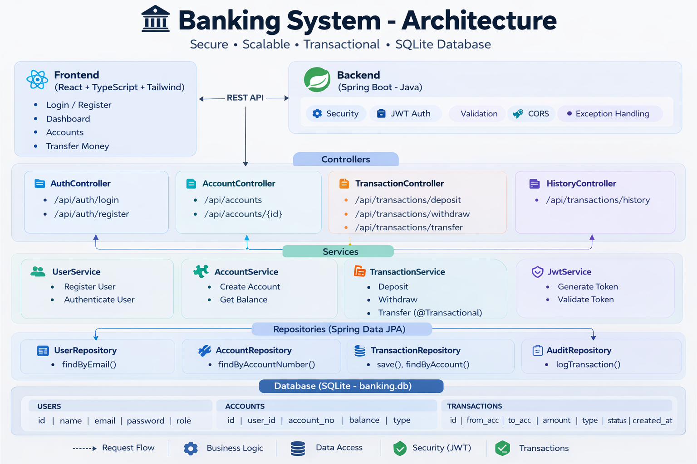

# Banking System

A production-style banking system backend built with Spring Boot and SQLite, featuring JWT authentication, account management, and secure fund transfers.



## Features

- **User Authentication**: JWT-based authentication with BCrypt password hashing
- **Account Management**: Create and manage multiple bank accounts (Savings, Checking, Business)
- **Transactions**: Deposit, withdraw, and transfer funds between accounts
- **Transaction History**: View paginated transaction history for any account
- **Transactional Safety**: SERIALIZABLE isolation for transfers to ensure data consistency

## Technology Stack

- **Backend**: Java 17+, Spring Boot 3.2.x
- **Database**: SQLite (local file-based)
- **Security**: Spring Security, JWT (jjwt)
- **Build Tool**: Maven

## Prerequisites

- Java 17 or higher
- Maven 3.6+

## Getting Started

### 1. Clone and Navigate

```bash
cd banking-system
```

### 2. Build the Project

```bash
mvn clean package
```

### 3. Run the Application

```bash
mvn spring-boot:run
```

The server will start at `http://localhost:8080`.

### 4. Database

The SQLite database file (`banking.db`) will be automatically created in the project root directory when the application starts.

## Configuration

### JWT Secret (Important!)

Before deploying to production, update the JWT secret in `src/main/resources/application.properties`:

```properties
app.jwt.secret=YOUR_SECURE_256_BIT_SECRET_HERE
```

Generate a secure secret using:
```bash
openssl rand -base64 32
```

### Application Properties

Key configurations in `application.properties`:

| Property | Description | Default |
|----------|-------------|---------|
| `server.port` | Server port | 8080 |
| `app.jwt.secret` | JWT signing secret | (placeholder) |
| `app.jwt.expiration-ms` | Token expiration (ms) | 86400000 (24h) |

## API Endpoints

### Authentication

| Method | Endpoint | Description |
|--------|----------|-------------|
| POST | `/api/auth/register` | Register a new user |
| POST | `/api/auth/login` | Login and get JWT token |

### Accounts

| Method | Endpoint | Description |
|--------|----------|-------------|
| POST | `/api/accounts` | Create a new account |
| GET | `/api/accounts` | Get all accounts for current user |
| GET | `/api/accounts/{accountNumber}` | Get account details |

### Transactions

| Method | Endpoint | Description |
|--------|----------|-------------|
| POST | `/api/transactions/deposit` | Deposit funds |
| POST | `/api/transactions/withdraw` | Withdraw funds |
| POST | `/api/transactions/transfer` | Transfer between accounts |
| GET | `/api/transactions/history/{accountNumber}` | Get transaction history |

## Example API Usage

### Register a User

```bash
curl -X POST http://localhost:8080/api/auth/register \
  -H "Content-Type: application/json" \
  -d '{
    "name": "John Doe",
    "email": "john@example.com",
    "password": "securepass123"
  }'
```

### Login

```bash
curl -X POST http://localhost:8080/api/auth/login \
  -H "Content-Type: application/json" \
  -d '{
    "email": "john@example.com",
    "password": "securepass123"
  }'
```

### Create an Account

```bash
curl -X POST http://localhost:8080/api/accounts \
  -H "Content-Type: application/json" \
  -H "Authorization: Bearer YOUR_JWT_TOKEN" \
  -d '{
    "accountType": "CHECKING"
  }'
```

### Deposit Funds

```bash
curl -X POST http://localhost:8080/api/transactions/deposit \
  -H "Content-Type: application/json" \
  -H "Authorization: Bearer YOUR_JWT_TOKEN" \
  -d '{
    "accountNumber": "ACC-XXXXXXXXXX",
    "amount": 1000.00,
    "description": "Initial deposit"
  }'
```

### Transfer Funds

```bash
curl -X POST http://localhost:8080/api/transactions/transfer \
  -H "Content-Type: application/json" \
  -H "Authorization: Bearer YOUR_JWT_TOKEN" \
  -d '{
    "fromAccountNumber": "ACC-XXXXXXXXXX",
    "toAccountNumber": "ACC-YYYYYYYYYY",
    "amount": 250.00,
    "description": "Payment"
  }'
```

## Running Tests

```bash
mvn test
```

## Project Structure

```
src/
├── main/
│   ├── java/com/lalit/bank/
│   │   ├── config/          # Configuration classes
│   │   ├── controller/      # REST controllers
│   │   ├── dto/             # Data transfer objects
│   │   ├── entity/          # JPA entities
│   │   ├── exception/       # Custom exceptions
│   │   ├── repository/      # JPA repositories
│   │   ├── security/        # JWT and security
│   │   └── service/         # Business logic
│   └── resources/
│       └── application.properties
└── test/
    └── java/com/lalit/bank/
        └── TransactionIntegrationTest.java
```

## Frontend

A React-based frontend is available in the `web-ui/` directory. See `web-ui/README.md` for setup instructions.

## SQLite Limitations

SQLite is suitable for development and small-scale deployments. For production environments with high concurrency, consider migrating to PostgreSQL or MySQL. The application uses SERIALIZABLE transaction isolation to ensure data consistency despite SQLite's limited row-level locking support.

## License

MIT License
